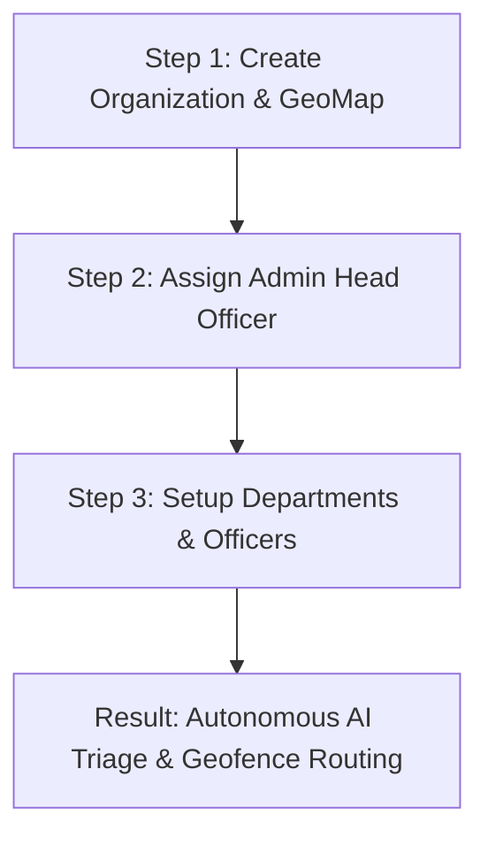

# Praja Disha (प्रजा दिशा) 🌐
### AI-Powered Spatial-Semantic Civic Triage & Decentralized Governance Platform

Praja Disha is a state-of-the-art municipal governance suite that connects citizens directly with local administrative bodies. By leveraging cutting-edge large language models (LLMs) and geographic boundary routing (geofencing), the platform automates issue triage, routes citizen reports to the correct municipal departments, and groups duplicate complaints to optimize municipal resource allocation.

---

## 🚀 Live Hosted Applications

The platform is fully deployed and accessible via the following portals:

| Portal | URL | Purpose |
| :--- | :--- | :--- |
| **Citizen App** | [https://praja-disha.web.app](https://praja-disha.web.app) | Used by citizens to report civic issues (via text, images, or voice notes), track status, and provide feedback. |
| **Admin Console** | [https://praja-disha-admin-console.web.app/dashboard](https://praja-disha-admin-console.web.app/dashboard) | Used by administrators and officers to manage departments, assign officers, monitor triage, and configure custom routing rules. |

---

## 🔑 Demo Access & Login Instructions

To test the **Admin Console** (Command Center) without receiving an external SMS OTP challenge, please use the configured dummy/demo authentication credentials defined in [login.strings.ts](frontend/Org-Admin-Dashboard/src/app/features/login/login.strings.ts):

1. Navigate to the Admin Console: [https://praja-disha-admin-console.web.app](https://praja-disha-admin-console.web.app)
2. Select the **Phone Number** login option.
3. Enter the demo mobile number: **`9999988888`**
4. Click **Send OTP**.
5. On the verification screen, enter the default OTP code: **`123456`**
6. Click **Verify & Enter** to access the dashboard.

---

## 🏗️ Platform Setup & Onboarding Workflow

Praja Disha is designed with a hierarchical, localized architecture. Setting up a new administrative region follows a precise three-step onboarding pipeline:

### 1. Organization & GeoMap Creation
First, a municipal organization (representing a city corporation, local constituency, or regional council) is created in the database. Each organization is mapped to a specific **`geoMap`** boundary—a GeoJSON polygon representing the exact geographic coordinates of the constituency.

### 2. Admin Officer Assignment
Once the organization is established, a senior official is added as the **Admin Officer** for that organization. This admin officer serves as the tenant administrator, possessing full command-center credentials to configure the localized setup.

### 3. Department & Officer Configuration
The Admin Officer logs in and registers the respective departments (e.g., Road Maintenance, Water Board, Sanitation, Power & Grid) and assigns officers. For the routing engine to function, **each department must mandatorily be configured with**:
* **Detailed Role Description**: A natural language explanation of the department's responsibilities, types of complaints it handles, and operational boundaries.
* **Geofencing Coordinates**: A spatial GeoJSON polygon boundary defining the department's exact geographic jurisdiction.
* **Custom AI Prompt Extension (Optional)**: Specific local tuning parameters or directives for the LLM to follow when routing issues to that department.

---

## 🤖 How the AI Triage & Routing Engine Works

The core of Praja Disha is its automated, event-driven triage pipeline. The system combines semantic text analysis, audio transcription, translation, geospatial operations, and vector embeddings to assign and route issues.

```mermaid
sequenceDiagram
    autonumber
    Citizen->>Backend: Submits Issue (Text/Audio + Geo-coordinates)
    Backend-->>Backend: Saves Ticket & Publishes TicketCreatedEvent
    Note over Backend: Async Triage Process Initiated
    rect rgb(30, 30, 40)
        Backend->>Google Speech: Transcribe Audio Note (if present)
        Backend->>Ollama/LLM: Translate transcript to English (if non-English)
        Backend->>Ollama/LLM: Run AI Triage Classifier (Inputs: Org Specs, Prompts, Dept Descs)
        Ollama/LLM-->>Backend: Returns Triage JSON (Category, Priority, Suggested Dept, Title, Language)
        Backend->>Ollama/LLM: Generate Vector Embedding of Ticket Text
        Backend->>Backend: Runs Spatial-Semantic Check (Duplicates within 500m & Similarity >= 0.82)
        Backend->>Backend: Maps Ticket Coordinates to Department Geofencing Bounds
        Backend->>Backend: Saves TaskAssignment (Head Officer of Matched Department)
    end
    Backend->>Admin Console: Ticket appears in Central Triage as "AI-Assigned"
```

### Under the Hood: Detailed Triage Processing Steps

1. **Submission**: A citizen submits a ticket from the mobile web app. The request includes the title/description, coordinate data (`latitude`, `longitude`), and an optional voice message.
2. **Asynchronous Listener Activation**: The ticket is saved in the database with status `Submitted`. A `TicketCreatedEvent` is published, which is consumed asynchronously by the [TriageEventListener.java](backend/src/main/java/gov/prajadisha/backend/task/event/TriageEventListener.java) to ensure zero latency for the user.
3. **Voice Transcribing & Translation**: If the citizen recorded a voice note, [TaskService.java](backend/src/main/java/gov/prajadisha/backend/task/service/TaskService.java) handles the audio:
   - Transcribes the audio using Google Speech-to-Text with local language support (Kannada, Hindi, Tamil, Telugu, etc.).
   - If the transcript is in a regional Indian language, the LLM translates it to English to serve as the ticket's primary description.
4. **LLM Classification (Spatial-Semantic Prompting)**: [AiTriageService.java](backend/src/main/java/gov/prajadisha/backend/ai/service/AiTriageService.java) constructs a context block containing:
   - The ticket's title, description, and address.
   - The organization's configuration categories, custom prompt rules, and priorities.
   - The roles and descriptions of all registered departments.
   - The AI uses this context to classify the ticket's category, priority level (`P0` to `P3`), primary language, and suggested department, while generating a short, actionable title. *(Note: If the LLM is temporarily unreachable, the system transparently switches to a deterministic keyword-based fallback classifier).*
5. **Spatial-Semantic Duplicate Check**: To avoid spamming officers with the same issue (e.g., multiple people reporting the same pothole), the system generates a text embedding vector via Ollama and queries similar tickets:
   - Checks within a geographic radius of **500 meters**.
   - If the description's cosine similarity is **>= 0.82**, they are automatically grouped under the same parent `groupId`.
6. **Geofenced Assignment Mapping**: Once the department is selected by the LLM, the backend cross-references the coordinates of the ticket with the geofenced constituency polygons of that department. If the location falls within the department's boundaries, a `TaskAssignment` is saved in the database, assigning the ticket to that department and routing it directly to the assigned Head Officer.

---

## 🔌 Extensibility to Other Industries

While Praja Disha is configured for civic governance and municipal services, its underlying architecture (combining spatial polygons, semantic descriptions, custom prompt templates, and AI-driven classification) makes it easily adaptable to any industry requiring location-aware incident management:

### 1. Enterprise IT Support & Hardware Dispatch
* **Entities**: Organizations = Corporate campuses; Departments = IT Support teams (e.g., Network Operations, Desktop Support, Server Maintenance).
* **Geofencing**: Spatial polygons represent building wings, floors, or remote office hubs.
* **Triage**: Network issues on the 3rd floor are auto-assigned to the 3rd-floor IT technician, while server alarms are routed directly to the Data Center Operations team based on building locations.

### 2. Healthcare Patient Care & Incident Routing
* **Entities**: Organizations = Hospitals or clinics; Departments = Medical departments (e.g., Cardiology, ICU, Pediatrics, Emergency).
* **Geofencing**: Spatial boundaries map hospital wards, wings, and clinics.
* **Triage**: Emergency alerts or nurse calls are analyzed by AI to determine urgency and routed to the nearest available nurse or specialist assigned to that ward.

### 3. Customer Service CRM & Field Dispatch
* **Entities**: Organizations = Service Providers (e.g., Telecom, Cable, Utilities); Departments = Regional service crews.
* **Geofencing**: Service territories mapped as polygons.
* **Triage**: AI classifies customer support tickets (e.g., "cable cut") and auto-schedules field technicians serving that specific neighborhood geofence.

### 4. Smart Facility & Property Management
* **Entities**: Organizations = Residential/Commercial real estate complexes; Departments = Maintenance divisions (e.g., Plumbing, HVAC, Elevators, Security).
* **Geofencing**: Polygons mapping block zones, clubhouses, parking structures, and individual towers.
* **Triage**: A leak report is parsed by the LLM, categorized as a plumbing hazard, and routed to the plumbing crew assigned to that specific tower block.